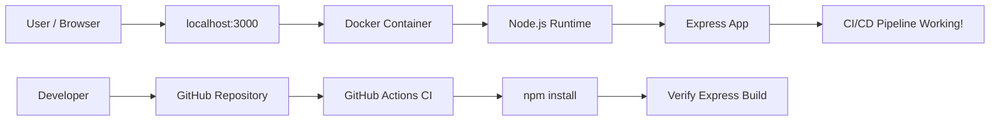

# DevOps Task New

A simple Node.js and Express application packaged with Docker and checked by a GitHub Actions CI workflow.

When the server is running, open:

```bash
http://localhost:3000
```

Expected response:

```text
CI/CD Pipeline Working!
```

## Repository

```bash
https://github.com/Anshuman-565/devops-task-new.git
```

## Tech Stack

- Node.js 20
- Express.js
- Docker
- GitHub Actions

## Project Structure

```text
.
|-- .dockerignore
|-- .github/workflows/main.yml
|-- .gitignore
|-- Dockerfile
|-- index.js
|-- package-lock.json
|-- package.json
`-- README.md
```

## Architecture Flow



## Run Locally Without Docker

Clone the repository:

```bash
git clone https://github.com/Anshuman-565/devops-task-new.git
cd devops-task-new
```

Install dependencies:

```bash
npm install
```

Start the server:

```bash
npm start
```

Open:

```bash
http://localhost:3000
```

Stop the server with:

```bash
Ctrl + C
```

## Run With Docker

Clone the repository:

```bash
git clone https://github.com/Anshuman-565/devops-task-new.git
cd devops-task-new
```

Build the Docker image:

```bash
docker build -t devops-task-new .
```

Run the container:

```bash
docker run -d --name devops-task-new-app -p 3000:3000 devops-task-new
```

Open:

```bash
http://localhost:3000
```

Check running containers:

```bash
docker ps
```

View app logs:

```bash
docker logs devops-task-new-app
```

Stop the container:

```bash
docker stop devops-task-new-app
```

Start the same container again:

```bash
docker start devops-task-new-app
```

Remove the container if you want to recreate it:

```bash
docker rm devops-task-new-app
```

If the container name already exists, remove the old stopped container first:

```bash
docker rm devops-task-new-app
docker run -d --name devops-task-new-app -p 3000:3000 devops-task-new
```

## Useful Docker Commands

List all containers:

```bash
docker ps -a
```

List Docker images:

```bash
docker images
```

Check what is using port 3000:

```bash
lsof -iTCP:3000 -sTCP:LISTEN
```

Remove the Docker image:

```bash
docker rmi devops-task-new
```

## CI/CD Workflow

The GitHub Actions workflow is located at:

```text
.github/workflows/main.yml
```

It runs automatically when code is pushed to the `main` branch.

Workflow steps:

1. Checkout the repository
2. Setup Node.js 20
3. Install dependencies with `npm install`
4. Verify the application dependency build

## Git Commands

Initialize Git only if the folder is not already a Git repository:

```bash
git init
```

Stage and commit changes:

```bash
git add .
git commit -m "Initial commit"
```

Add the GitHub remote:

```bash
git remote add origin https://github.com/Anshuman-565/devops-task-new.git
```

Push to GitHub:

```bash
git branch -M main
git push -u origin main
```
